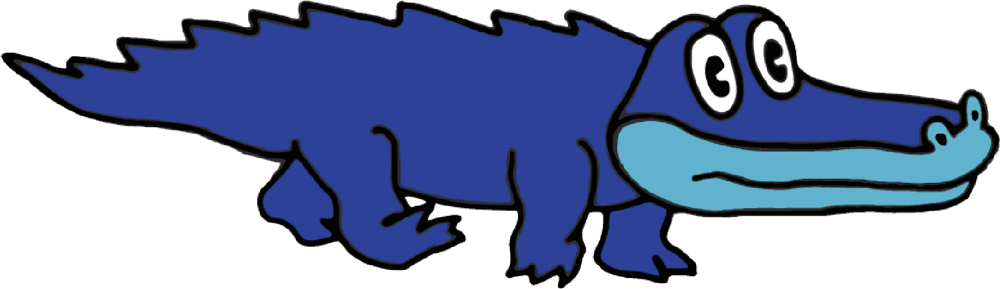

<!-- README.md is generated from README.Rmd. Please edit that file -->

```{r, include = FALSE}
knitr::opts_chunk$set(
  collapse = TRUE,
  comment = "#>",
  fig.path = "man/figures/README-",
  out.width = "100%"
)
```
# kgatlw

<!-- badges: start -->
<!-- badges: end -->

**kgatlw** are palettes inspired by King Gizzard and the Lizard Wizzard's artwork by [Jason Galea](https://www.jasongalea.com/).

## Installation

``` r
install.packages("devtools")
devtools::install_github("nlopezc/kgatlw")
```

## Available palettes

```{r}
library(kgatlw)
```

### 12 Bar Bruise (2012)
```{r, fig.height=3, fig.width=15}
kgatlw_palette("twelvebar")
```

### Eyes Like the Sky (2013)
```{r, fig.height=3, fig.width=15}
kgatlw_palette("elts")
```

### Float Along - Fill Your Lungs (2013)
```{r, fig.height=3, fig.width=15}
kgatlw_palette("floatalong")
```

### Oddments (2014)
```{r, fig.height=3, fig.width=15}
kgatlw_palette("oddments")
```

### I'm in Your Mind Fuzz (2014)
```{r, fig.height=3, fig.width=15}
kgatlw_palette("mindfuzz")
```

### Quarters! (2015)
```{r, fig.height=3, fig.width=15}
kgatlw_palette("quarters1")
```

### Paper Mâché Dream Balloon (2015)
```{r, fig.height=3, fig.width=15}
kgatlw_palette("papermache")
```

### Nonagon Infinity (2016)
```{r, fig.height=3, fig.width=15}
kgatlw_palette("nonagon")
```

### Flying Microtonal Banana (2017)
```{r, fig.height=3, fig.width=15}
kgatlw_palette("microbanana")
```

### Murder of the Universe (2017)
```{r, fig.height=3, fig.width=15}
kgatlw_palette("motu")
```

### Sketches of Brunswick East (2017)
```{r, fig.height=3, fig.width=15}
kgatlw_palette("sketches")
```

### Polygondwanaland (2017)
```{r, fig.height=3, fig.width=15}
kgatlw_palette("polygondwana")
```

### Gumboot Soup (2017)
```{r, fig.height=3, fig.width=15}
kgatlw_palette("gumboot")
```

### Gizzfest 2017 tour poster
```{r, fig.height=3, fig.width=15}
kgatlw_palette("gizzfest2017")
```

### Gizzfest 2018 tour poster
```{r, fig.height=3, fig.width=15}
kgatlw_palette("gizzfest2018")
```

### Mexico 2018 tour poster
```{r, fig.height=3, fig.width=15}
kgatlw_palette("mex2018")
```

### Fishing for Fishies (2019)
```{r, fig.height=3, fig.width=15}
kgatlw_palette("fff")
```

### Infest the Rats' Nest + Self-immolate and Organ Farmer (2019)
```{r, fig.height=3, fig.width=15}
kgatlw_palette("itrn")
```

## Examples

### Continuous palettes

```{r, fig.height=3, fig.width=15}
kgatlw_palette("floatalong", n = 15, type = "continuous")
```

```{r, fig.height=3, fig.width=15}
kgatlw_palette("sketches", n = 15, type = "continuous")
```

### Graphs using kgatlw

Nothing here yet.

<br /><br /><br /><br /><br /><br /><br /><br />

{ width=30% }
