<!-- README.md is generated from README.Rmd. Please edit that file -->
kgatlw
======

<!-- badges: start -->
<!-- badges: end -->
**kgatlw** are palettes inspired by King Gizzard and the Lizard Wizzard's artwork by [Jason Galea](https://www.jasongalea.com/).

Installation
------------

``` r
install.packages("devtools")
devtools::install_github("nlopezc/kgatlw")
```

Available palettes
------------------

``` r
library(kgatlw)
```

### 12 Bar Bruise (2012)

``` r
kgatlw_palette("twelvebar")
```

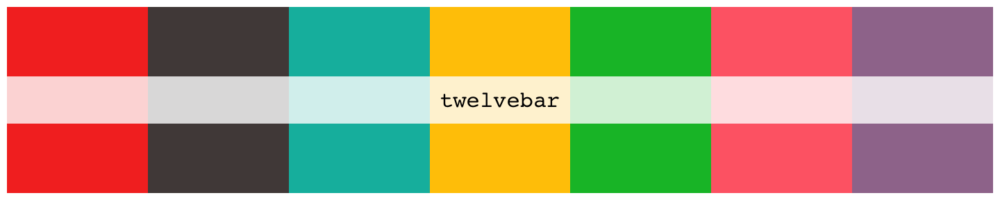

### Eyes Like the Sky (2013)

``` r
kgatlw_palette("elts")
```

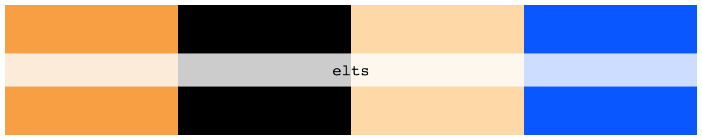

### Float Along - Fill Your Lungs (2013)

``` r
kgatlw_palette("floatalong")
```

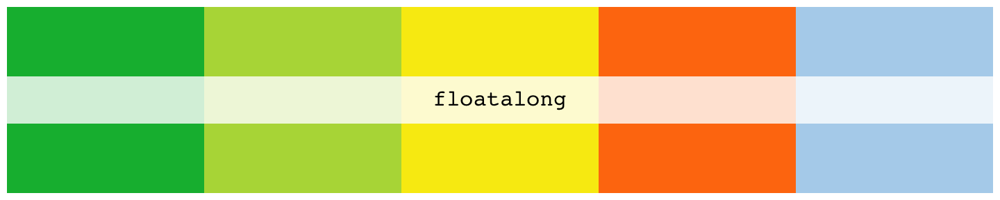

### Oddments (2014)

``` r
kgatlw_palette("oddments")
```

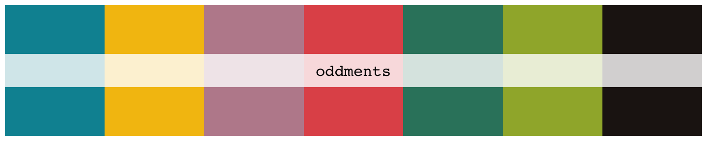

### I'm in Your Mind Fuzz (2014)

``` r
kgatlw_palette("mindfuzz")
```

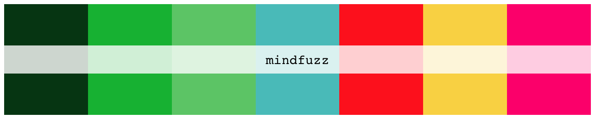

### Quarters! (2015)

``` r
kgatlw_palette("quarters1")
```

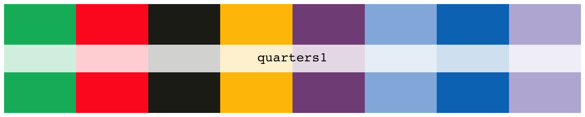

### Paper Mâché Dream Balloon (2015)

``` r
kgatlw_palette("papermache")
```

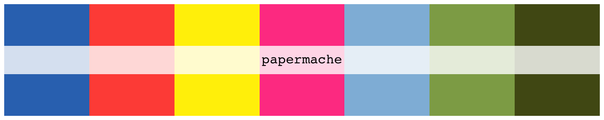

### Nonagon Infinity (2016)

``` r
kgatlw_palette("nonagon")
```

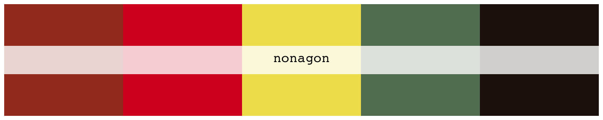

### Flying Microtonal Banana (2017)

``` r
kgatlw_palette("microbanana")
```

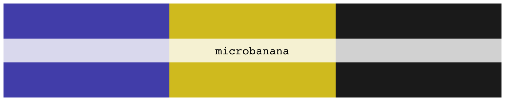

### Murder of the Universe (2017)

``` r
kgatlw_palette("motu")
```

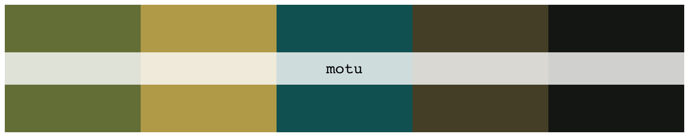

### Sketches of Brunswick East (2017)

``` r
kgatlw_palette("sketches")
```

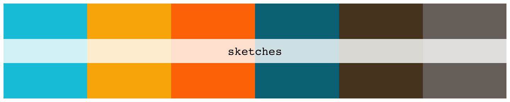

### Polygondwanaland (2017)

``` r
kgatlw_palette("polygondwana")
```

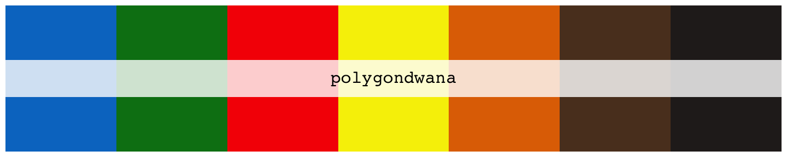

### Gumboot Soup (2017)

``` r
kgatlw_palette("gumboot")
```

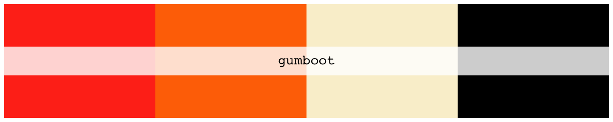

### Gizzfest 2017 tour poster

``` r
kgatlw_palette("gizzfest2017")
```

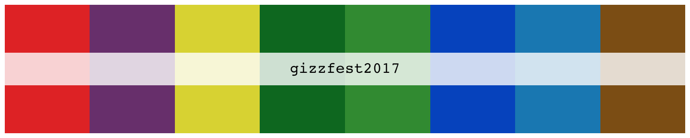

### Gizzfest 2018 tour poster

``` r
kgatlw_palette("gizzfest2018")
```

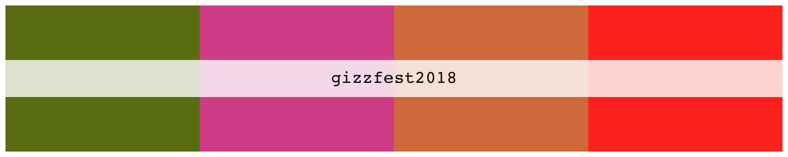

### Mexico 2018 tour poster

``` r
kgatlw_palette("mex2018")
```

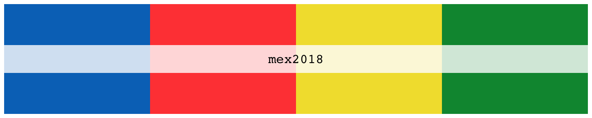

### Fishing for Fishies (2019)

``` r
kgatlw_palette("fff")
```

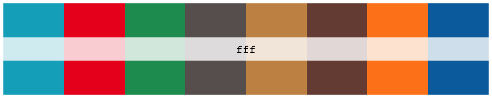

### Infest the Rats' Nest + Self-immolate and Organ Farmer (2019)

``` r
kgatlw_palette("itrn")
```

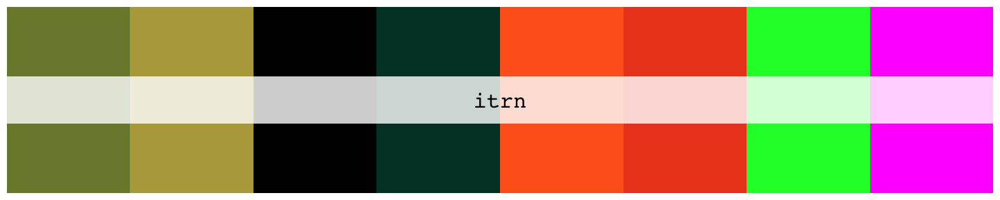

Examples
--------

### Continuous palettes

``` r
kgatlw_palette("floatalong", n = 15, type = "continuous")
```

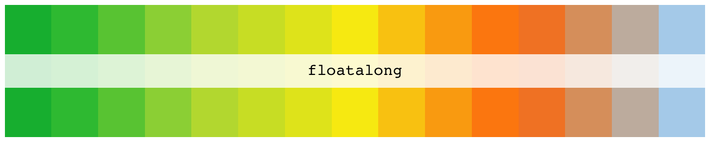

``` r
kgatlw_palette("sketches", n = 15, type = "continuous")
```

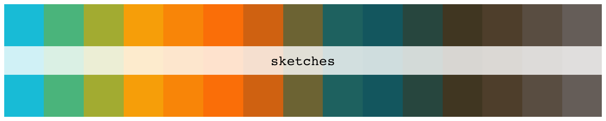

### Graphs using kgatlw

Nothing here yet.

<br /><br /><br /><br /><br /><br /><br /><br />

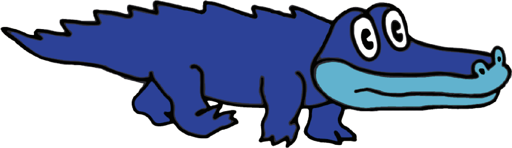
